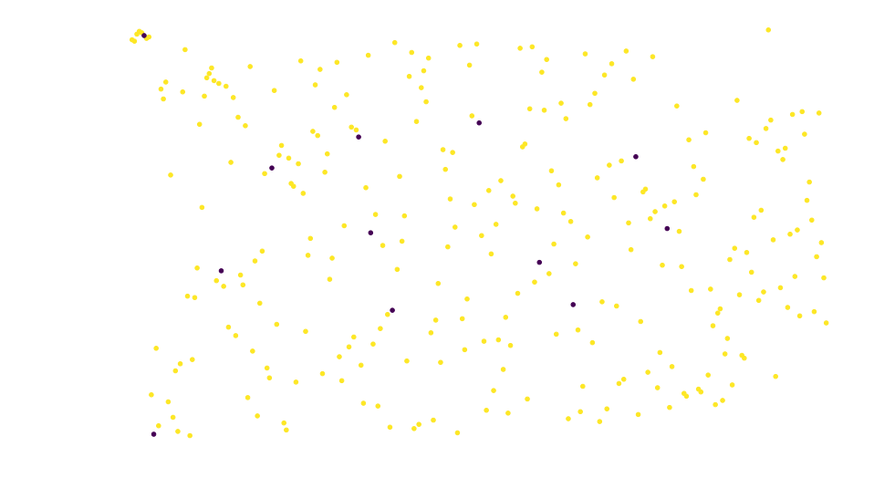
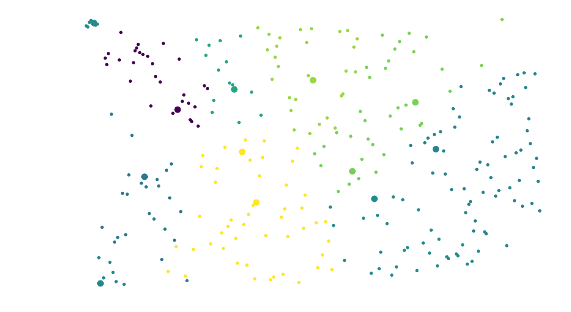

# Кластеризация с нейронной сетью Кохонена

* [Постановка задачи](#1)
* [Результаты](#2)

## Постановка задачи
Выполнить разбиение библиотек г.Москвы (датасет из http://data.mos.ru/datasets/503) при помощи НС Кохонена с использованием метрики принадлежности округу Москвы (Евклидово расстояние до координат центра округа).

## Результаты
Входные данные:

Кластеризованные данные:

